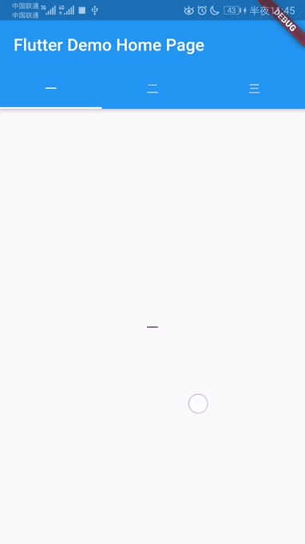

# union_tabs

 

A nested TabBarView overscroll event unites outer TabBarView scroll event

## Getting Started

**1.Install**
```yaml
dependencies:
  union_tabs: ^1.0.0+3
```

**2.Import**

```dart
import 'package:union_tabs/union_tabs.dart';
```

**3.Usage**
```
  @override
  Widget build(BuildContext context) {
    return Scaffold(
        appBar: AppBar(
          title: Text(widget.title),
          bottom: TabBar(
              controller: _controller,
              tabs: tabsText.map((it) => Tab(text: it)).toList()),
        ),
        body: UnionOuterTabBarView( /// outerTabBarView
          controller: _controller,
          children: _createTabContent(),
        ));
  }

  List<Widget> _createTabContent() {
    List<Widget> tabContent = List();
    tabContent.add(Center(child: Text(tabsText[0])));
    final child = Column(
      children: <Widget>[
        TabBar(
            labelColor: Colors.black,
            unselectedLabelColor: Colors.black45,
            controller: _childController,
            tabs: secondTabsText.map((it) => Tab(text: it)).toList()),
        Expanded(
          child: UnionInnerTabBarView( /// innerTabBarView
              controller: _childController,
              children:
                  secondTabsText.map((it) => Center(child: Text(it))).toList()),
        )
      ],
    );
    tabContent.add(child);
    tabContent.add(Center(child: Text(tabsText[2])));
    return tabContent;
  }
```

More detail see example: main.dart